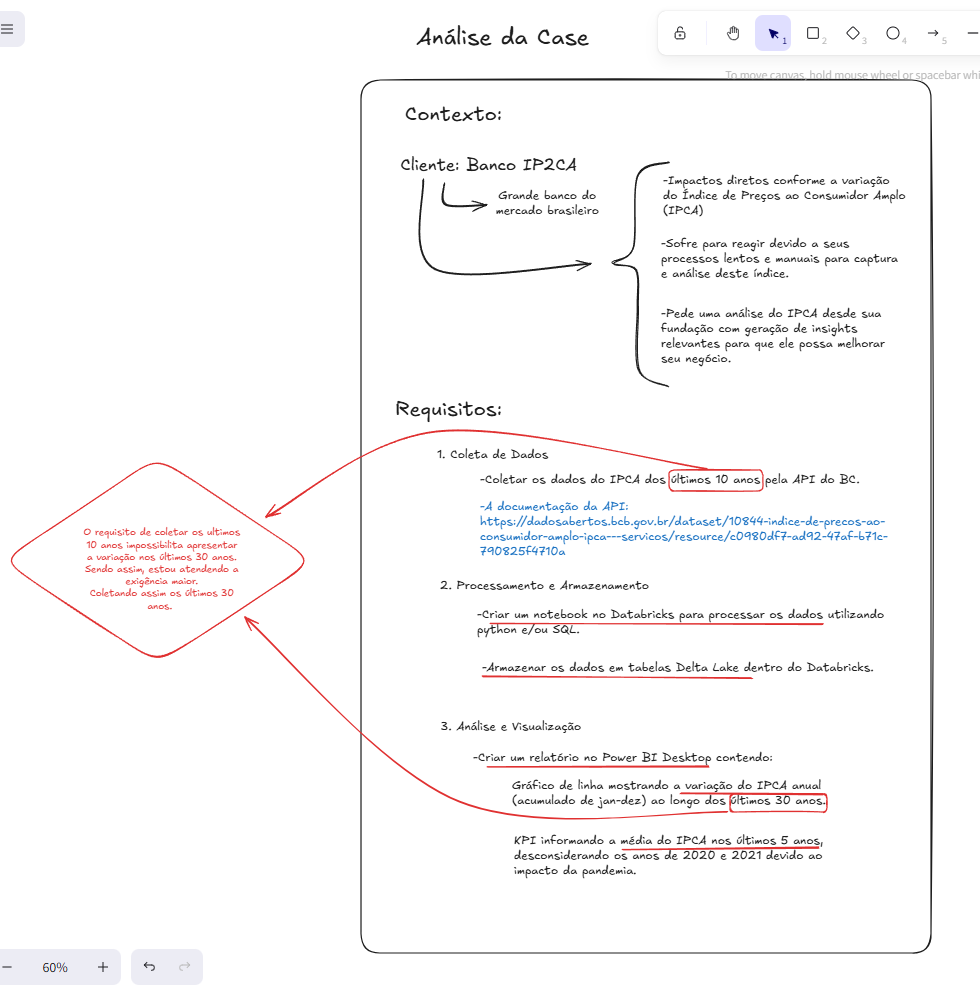
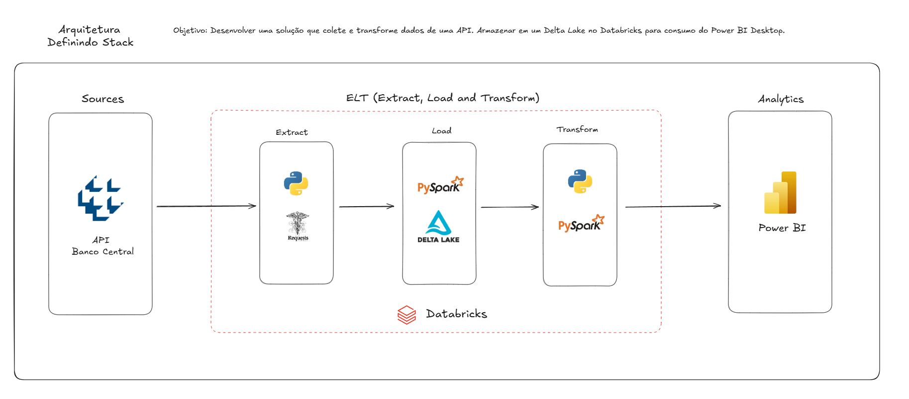
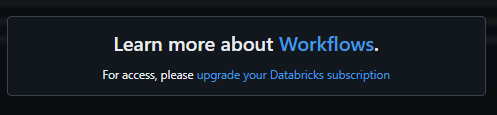
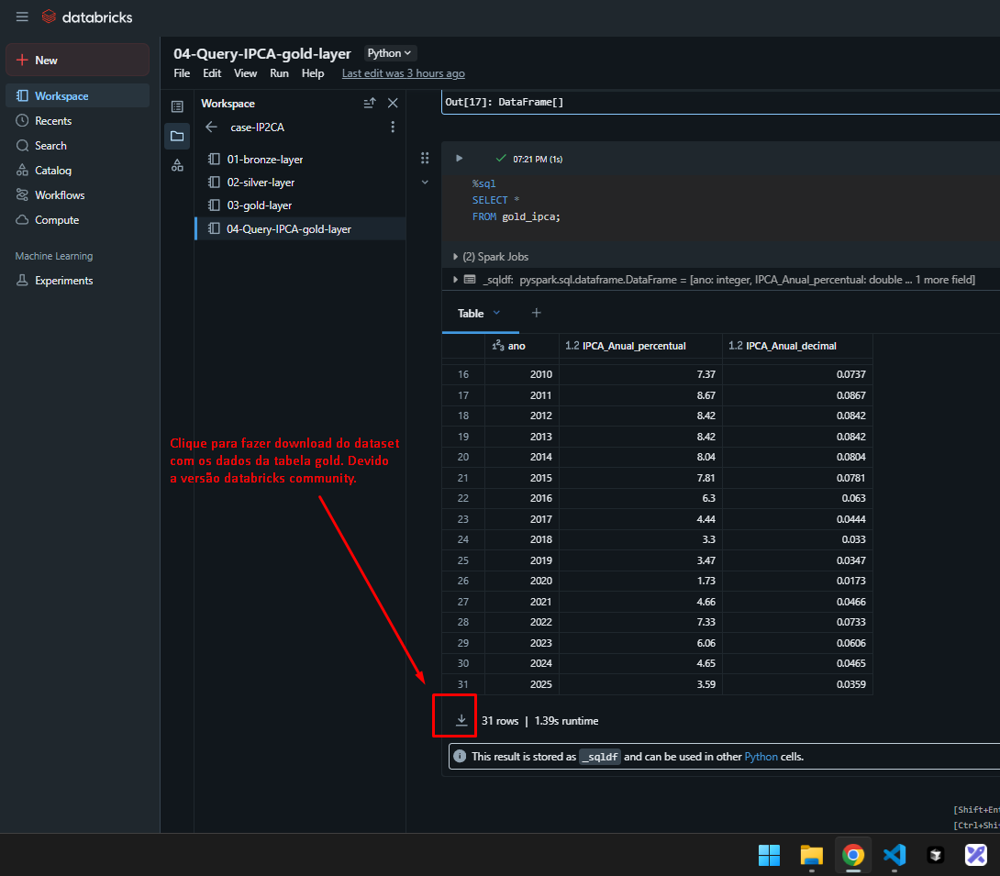

# Databricks Lakehouse para Análise do IPCA

## Entendendo o Projeto

### Contexto e requisitos:

*"Nosso cliente é o Banco IP2CA, um grande banco do mercado brasileiro de varejo com atuação há 30 anos e uma base de 50 milhões de clientes ativos.*

*O cliente tem impactos diretos conforme a variação do Índice de Preços ao Consumidor Amplo (IPCA) e atualmente sofre para reagir devido a seus processos lentos e manuais para captura e análise deste índice.*

*Diante disto, o cliente pede uma análise do IPCA desde sua fundação com geração de insights relevantes para que ele possa melhorar seu negócio."*

Análise e requisitos:


### Objetivo:

O objetivo é criar um pipeline de dados robusto e escalável, desde a ingestão da fonte original (API do Banco Central do Brasil) até a disponibilização de dados agregados para análise e visualização no Power BI.


### Componentes Principais:

*   **Fonte de Dados:** [API do Banco Central do Brasil](https://dadosabertos.bcb.gov.br/dataset/10844-indice-de-precos-ao-consumidor-amplo-ipca---servicos/resource/c0980df7-ad92-47af-b71c-790825f4710a?inner_span=True) (BCB) para dados históricos do IPCA.
*   **Databricks Community:** Plataforma unificada para engenharia de dados, machine learning e análise.
*   **Delta Lake:** Camada de armazenamento de dados que oferece transações ACID, versionamento, e escalabilidade sobre o data lake.
*   **Python:** Linguagem de programação utilizada para o desenvolvimento dos notebooks de processamento de dados.
*   **Power BI:** Ferramenta de Business Intelligence para visualização e análise dos dados finais.

### Arquitetura e Fluxo de Dados:

Uma representação visual da arquitetura pode ser encontrada no arquivo `01-architecture/Architecture-case-ip2ca.excalidraw`, como na imagem abaixo:



O fluxo de dados é organizado em três camadas principais, seguindo a metodologia de medalhões (Bronze, Silver, Gold):

1.  **Camada Bronze (Raw Data):** Ingestão de dados brutos diretamente da API do BCB. Os dados são armazenados no formato Delta Lake, mantendo a integridade e o histórico.
2.  **Camada Silver (Cleaned & Conformed Data):** Limpeza, padronização e enriquecimento dos dados da camada Bronze. Nesta etapa, são aplicadas transformações para garantir a qualidade e a consistência dos dados.
3.  **Camada Gold (Curated & Aggregated Data):** Agregação e sumarização dos dados da camada Silver para atender a requisitos específicos de negócios e análise. Esta camada é otimizada para consumo por ferramentas de BI.

## Pré-requisitos

Para replicar este projeto, você precisará dos seguintes itens:

*   **Databricks Community:** Uma conta no Databricks Community para executar os notebooks e gerenciar o Delta Lake.
*   **Python:** Conhecimento intermediario em Python para entender e modificar os scripts.
*   **Power BI Desktop:** Para abrir e interagir com o dashboard de exemplo.

## Estrutura do Projeto

O projeto está organizado da seguinte forma:

```
databricks-lakehouse-ipca/
├── 01-architecture/                  # Diagramas de arquitetura
│   └── Architecture-case-ip2ca.excalidraw
├── 02-notebooks/                     # Notebooks Databricks (Python)
│   ├── 01-bronze-layer.py
│   ├── 02-silver-layer.py
│   ├── 03-gold-layer.py
│   └── 04-Query-IPCA-gold-layer.py
├── 03-analytics/                     # Artefatos de análise e BI
│   ├── 01-layouts-figma/
│   │   ├── Guia-Usuario.svg
│   │   └── dash-ipca.svg
│   ├── 02-Dataset/
│   │   └── 04_Query_IPCA_gold_layer.csv
│   └── 03-Dashboard-IPCA.pbix
├── 04-pics/                          # Imagens de apoio e screenshots
│   ├── 01-analise-case.png
│   ├── 02-arquitetura-definindo-stack.png
│   ├── 03-camada-bronze.png
│   ├── 04-camada-silver.png
│   ├── 05-camada-gold.png
│   ├── 06-query-tabela-gold.png
│   └── 07-baixar-dataset.png
└── README.md                         # Este arquivo
```

## Configuração e Execução

Siga os passos abaixo para configurar e executar o projeto no seu ambiente Databricks:

### 1. Importar Notebooks para o Databricks

1.1.  No seu Databricks Workspace, navegue até a área de 'Workspace'.

1.2.  Clique com o botão direito em uma pasta desejada (ou crie uma nova) e selecione 'Import'.

1.3.  Escolha a opção 'File' e faça o upload dos arquivos `.py` localizados na pasta `02-notebooks` do projeto (`01-bronze-layer.py`, `02-silver-layer.py`, `03-gold-layer.py`, `04-Query-IPCA-gold-layer.py`). 

Certifique-se de que o formato de importação seja 'Python Notebook'.

### 2. Executar os Notebooks

Os notebooks devem ser executados na seguinte ordem para garantir a correta progressão dos dados pelas camadas Bronze, Silver e Gold:

2.1.  **`01-bronze-layer.py`:**

*   Este notebook é responsável por consumir a API do Banco Central do Brasil e carregar os dados brutos do IPCA para a camada Bronze do Delta Lake.
*   Ele busca dados dos últimos 30 anos até a data atual.
*   Os dados são particionados por ano e mês para otimização de consultas.
*   **Local de armazenamento:** `/FileStore/tables/case_ip2ca/bronze`

2.2.  **`02-silver-layer.py`:**

*   Este notebook lê os dados da camada Bronze, aplica etapas de limpeza e padronização (como remoção de valores nulos e duplicatas) e salva os dados processados na camada Silver.
*   **Local de armazenamento:** `/FileStore/tables/case_ip2ca/silver`

2.3.  **`03-gold-layer.py`:**

*   Este notebook processa os dados da camada Silver, realizando agregações para calcular o IPCA acumulado anualmente.
*   Os dados resultantes são armazenados na camada Gold, otimizados para consumo por ferramentas de BI.
*   **Local de armazenamento:** `/FileStore/tables/case_ip2ca/gold`

2.4.  **`04-Query-IPCA-gold-layer.py`:**

*   Este notebook demonstra como consultar os dados da camada Gold. Ele pode ser usado para verificar os dados antes de conectá-los ao Power BI ou para exportar um CSV de exemplo.

**Observações:** 

*   Bom, neste caso de ambiente de estudo não me preocupei com orquestrar os notebooks, até por que esta opção não é disponivel no Databricks Community Edition. Mas, vale lembrar que esta etpa é de extrema importancia para um ambiente de produção. Segue imagem abaixo:
    
    
*   Certifique-se de que os caminhos de armazenamento (`/FileStore/tables/case_ip2ca/bronze`, `/FileStore/tables/case_ip2ca/silver`, `/FileStore/tables/case_ip2ca/gold`) estejam acessíveis e configurados corretamente no seu ambiente Databricks. Eles são definidos dentro de cada notebook.

### 3. Conectar o Power BI ao Delta Lake (Camada Gold)

Como este projeto foi desenvolvido com o Databricks Community Edition temos uma limitação com a conexão direta do power bi no databricks. Sendo assim, tomei como uma medida alternativa extrair o dataset da tabela gold e importar os dados pelo arquivo local em anexo `03-analytics/dataset/04_query_ipca_accumulated_annual.csv`. Para extrair o seu dataset execute o notebook `02-notebooks\04-Query-IPCA-gold-layer.py` e faça download da tabela conforme o print abaixo.



**Observação:** O arquivo `.pbix` já está do dataset importando. Porem, se quiser refazer as etapas e extrair seu dataset você vai precisar atualizar o caminho da fonte de dados.


## Resultados e Visualização

Após a execução bem-sucedida dos notebooks e a conexão com o Power BI, você poderá visualizar e analisar os dados do IPCA de forma interativa. O dashboard de exemplo (`03-Dashboard-IPCA.pbix`) oferece uma visão clara do IPCA anual, permitindo explorar tendências e padrões ao longo do tempo.

As imagens na pasta `04-pics` fornecem exemplos de visualizações e etapas do processo, incluindo:

*   `01-analise-case.png`: Análise inicial do caso.
*   `02-arquitetura-definindo-stack.png`: Diagrama da arquitetura proposta.
*   `03-camada-bronze.png`: Exemplo de dados na camada Bronze.
*   `04-camada-silver.png`: Exemplo de dados na camada Silver.
*   `05-camada-gold.png`: Exemplo de dados na camada Gold.
*   `06-query-tabela-gold.png`: Exemplo de consulta à tabela Gold.
*   `07-baixar-dataset.png`: Demonstração de como baixar o dataset de exemplo.

Essas visualizações demonstram a eficácia da arquitetura Data Lakehouse em fornecer dados limpos e agregados para análise de negócios.


## Contribuições

Contribuições são bem-vindas! Em caso de dúvidas ou networking pode entra em contato comigo pelos canais disponíveis na minha Bio. Obrigado!